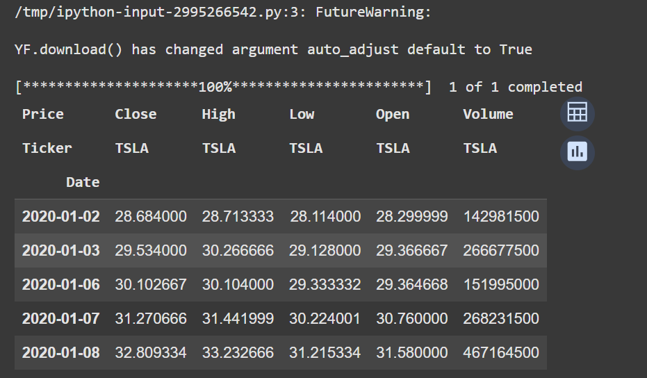
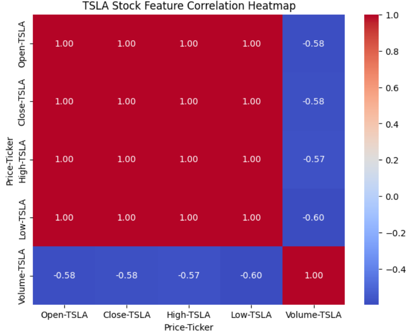
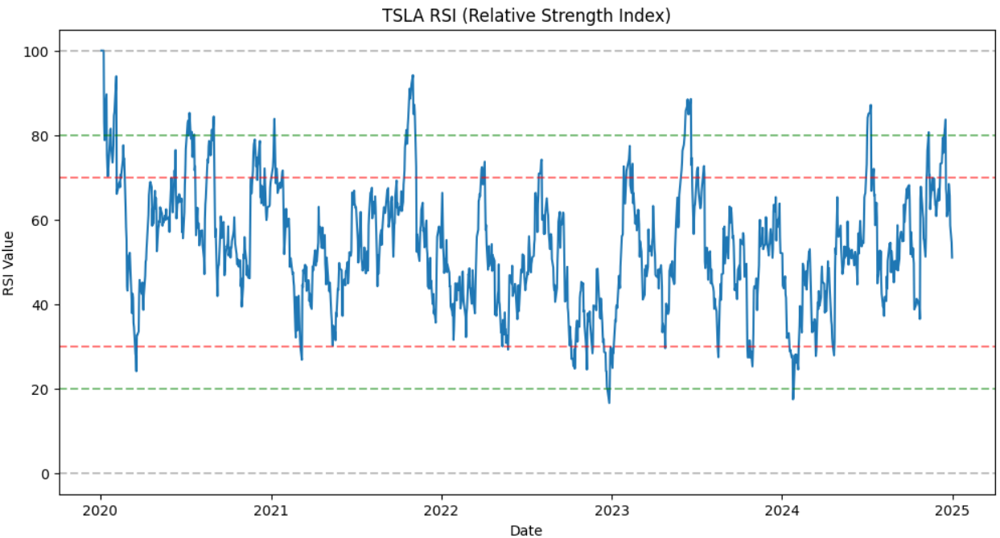
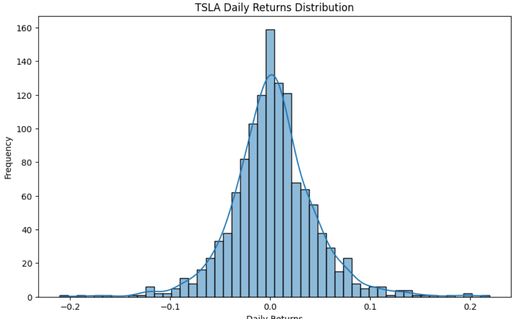

# Stock-Market-Prediction-
An interactive stock market analysis and prediction tool built in Python (Google Colab + Plotly Dash + LSTM). This project combines financial technical analysis with machine learning models to provide insights into stock market trends. This project focuses on analyzing and predicting Tesla (TSLA) stock trends using historical data. It includes data collection, preprocessing, visualization, and technical analysis with indicators like RSI (Relative Strength Index) and daily returns distribution.

Features
Download historical stock data using Yahoo Finance API
Perform feature correlation analysis
Calculate technical indicators (RSI)
Analyze daily returns distribution
Visualize and interpret stock patterns

Dataset
The dataset is fetched directly using the yfinance Python package.
Stock: Tesla Inc. (TSLA)
Date Range: 2020 – 2025
Features: Open, High, Low, Close, Volume

Visualizations
1. Stock Price Dataset Preview
This shows the first few rows of Tesla stock data.

2. Feature Correlation Heatmap
Correlation between Open, Close, High, Low, and Volume.
Prices are highly correlated (close to 1.0)
Volume has a negative correlation (~ -0.58) with prices

3. Relative Strength Index (RSI)
RSI helps identify overbought (>70) and oversold (<30) conditions.
Tesla frequently fluctuates between these levels
Useful for timing buy/sell decisions

4. Daily Returns Distribution
Histogram with kernel density curve of daily returns.
Distribution is roughly normal
Most returns are close to 0%, with fat tails showing volatility

Tech Stack

Python 3.10+
Libraries:
yfinance – stock data collection
pandas, numpy – data preprocessing
matplotlib, seaborn – visualization
scipy – statistical analysis

Future Scope

Add machine learning models (LSTM, ARIMA, Random Forest) for prediction
Incorporate sentiment analysis from news/Twitter
Deploy as a web dashboard using Streamlit

Conclusion

This project demonstrates how stock market data can be collected, analyzed, and visualized effectively. By combining correlation analysis, RSI indicator, and returns distribution, we gain valuable insights into Tesla’s stock behavior — a solid foundation for further predictive modeling.
